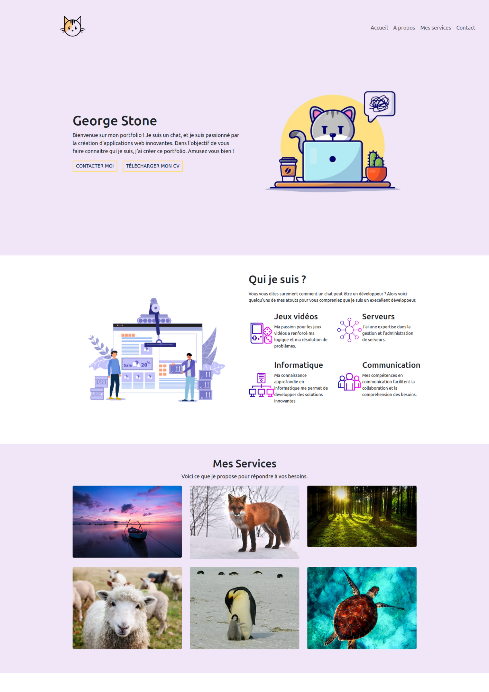
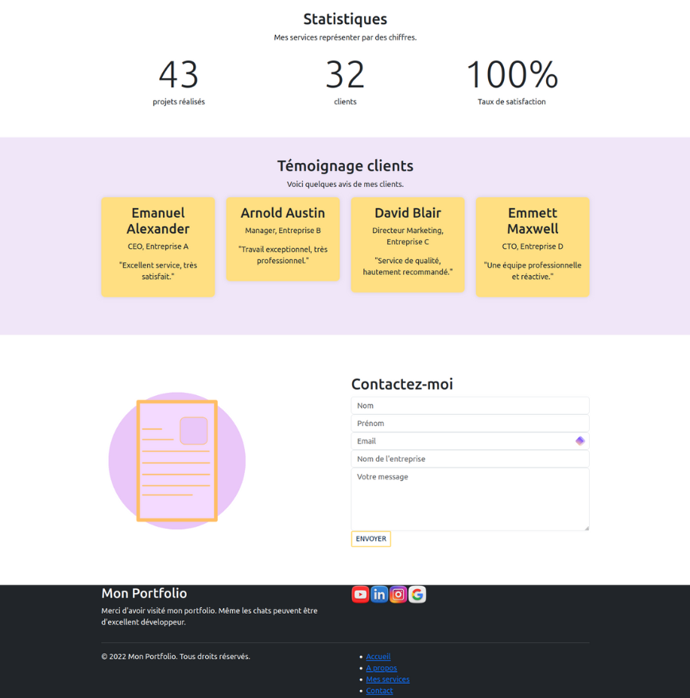

# Portfolio Template

Il s'agit d'un modèle de Portfolio contenant des informations fictives.






## Specifications

React

Bootstrap

Npm

## Utilisation

``` git clone  https://github.com/Kami-404/Portfolio-Template.git ```

``` cd Portfolio-Template ```

``` npm install ```

``` npm start ```

Ouvrez [http://localhost:3000](http://localhost:3000) pour l'afficher dans votre navigateur.

## Répertoire

Ce portfolio contient seulement une seule page séparée en différentes sections. Tous les composants sont directement mis dans le fichier App.js. Chaque composant possède son propre fichier css, l'ensemble des composants se trouve dans le dossier 'pages' et les images utilités pour le projet sont dans le dossier 'images'. Les boutons ne sont pas fonctionnels, tout comme le formulaire de contacte et les liens sur le template.

Le reste des fichiers sont générés par ``` npx create react app ```.


## Merci d'avoir utilisé ce projet !

J'ai simplement réalisé ce projet pour m'amuser. J'espère qu'il vous sera utile et qu'il répondra à vos besoins.